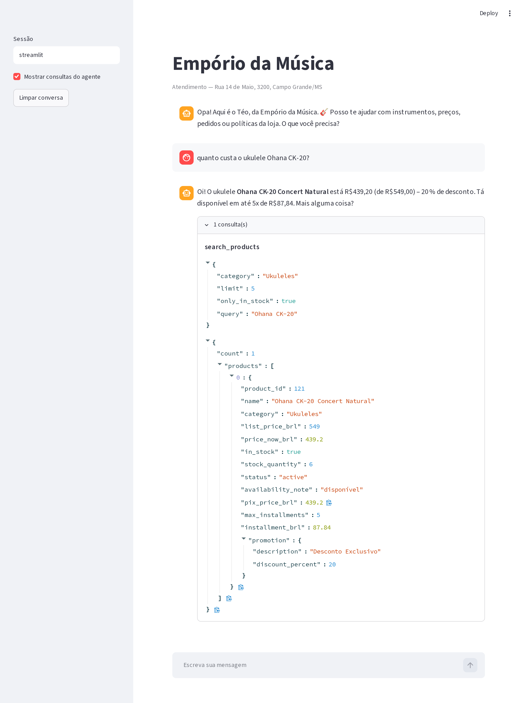
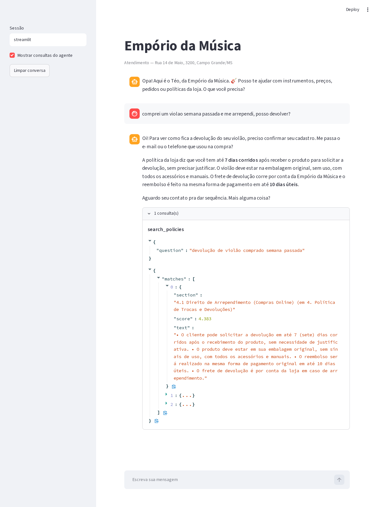

# Empório da Música — support agent

A text agent that answers customers of Empório da Música, a musical instrument
store in Campo Grande/MS. It reads the store's operational data and its internal
policy manual, and it knows which of the two a question belongs to.

Written for the Artefact AI Engineer technical case. The agent speaks Brazilian
Portuguese because its customers do; this document is in English as the case
requires.

```
customer ──▶ LLM (Groq) ──▶ tool ──▶ SQLite (catalogue, orders)
                        └──▶ tool ──▶ BM25 over the policy manual
                        └──▶ answer, written from what came back
```

## Running it

Requires Python 3.11+ and a free Groq API key from
[console.groq.com/keys](https://console.groq.com/keys).

```bash
python -m venv .venv && source .venv/bin/activate
pip install -r requirements.txt

cp .env.example .env        # then paste your key into GROQ_API_KEY
python -m emporio.etl       # builds data/emporio.db from the CSVs
```

`src` has to be on the path — either `pip install -e .` style or the explicit
prefix used below.

```bash
PYTHONPATH=src python -m emporio.cli                      # terminal chat
PYTHONPATH=src python -m emporio.cli --show-tools         # shows each lookup
PYTHONPATH=src python -m emporio.cli --ask "que horas abre no sábado?"

streamlit run app.py                                      # browser chat

pytest                                                    # 112 tests, no API key
pytest -m spec                                            # only the policy clauses
python scripts/spec_matrix.py                             # regenerates SPEC.md
```

The dataset is a snapshot whose last order is from March 2026, so deadlines like
"7 days to return" are meaningless against a real clock. `EMPORIO_TODAY` pins the
reference date:

```bash
EMPORIO_TODAY=2026-03-25 PYTHONPATH=src python -m emporio.cli
```

It pins the date everywhere, `store_info` included: with a Sunday pinned, the
store reports itself closed. Only the time of day stays real, because no dataset
carries an hour and *"are you open now?"* needs one.

## What it does

- Answers about the catalogue: what exists, what it costs, what is in stock.
- Answers about policy: returns, warranty, shipping, payment, opening hours.
- Looks up an order, but only after the customer proves the order is theirs.
- Turns down what the store does not sell, and what is not the store's business.

Five example conversations are in [`examples/`](examples/). They are generated by
`scripts/record_examples.py` against the real agent, not written by hand, so what
the repo shows is what the agent actually says.

[`SPEC.md`](SPEC.md) maps every policy clause the agent enforces to the code that
enforces it and the tests that pin it. It is generated too — see
[How this was built](#how-this-was-built).

## Technical decisions

### Function calling, not a SQL agent

The model never writes a query. It picks from five typed tools and the tools run
fixed SQL. This costs flexibility — a question no tool covers gets no answer —
and buys the thing this particular store needs: the manual (7.1) says *"nunca
fornecer informações sobre preços, estoque ou prazos sem consultar o sistema.
Informações incorretas geram frustração e podem configurar propaganda enganosa"*.
A free-form SQL agent makes a wrong number a prompt-engineering problem. Typed
tools make it a code problem, which is a problem you can test.

The five tools:

| Tool | What it answers |
|---|---|
| `search_products` | catalogue search with price range and stock filters |
| `get_product` | one product: specs, description, stock, payment breakdown |
| `get_order` | order status, tracking, and which return windows are still open |
| `search_policies` | the relevant sections of the policy manual |
| `store_info` | address, contacts, opening hours, whether it is open right now |

### Business rules in Python, not in the prompt

The sharpest rule in the manual is 6.2: the 5% PIX discount does **not** stack on
an already discounted price. Rules like that live in `src/emporio/rules.py` and
are covered by tests — pricing, the three installment bands, free shipping over
R$500, and the 7 / 30 / 90 day windows for regret, defect exchange and legal
warranty.

Putting them in the system prompt would mean re-deriving them on every turn and
getting them right most of the time. Most of the time is not a standard you can
hold a store to. So the split is: **the model routes and writes, the code
decides the number.**

The `catalog` SQL view resolves the live promotion once, which means nothing
downstream can accidentally stack two discounts.

### Retrieval: BM25 over the manual's own sections

The manual is eight pages in ten numbered sections. The document already tells us
where the chunks are, so chunking is section-level and the index is BM25
(`rank_bm25`) over those chunks.

No embedding service, no vector store, no index to keep in sync — and the result
is auditable: you can see which section matched and why. Two details make it
work:

- pypdf's `layout` extraction mode, because the default mode returns one word per
  line and destroys the headings.
- A heading is only accepted when it continues the numbering. Section 7.2 is a
  numbered list whose items look exactly like headings, and without that check it
  opens a bogus "section 1" that swallows the rest of the manual.
- Tokens are cut to a five-letter prefix. Customers write *"me arrependi"*; the
  manual says *"arrependimento"*. A crude stemmer closes that gap at a fraction
  of the cost of embeddings.

**When I would switch to embeddings:** when the corpus grows past a few dozen
pages, or spans several documents, or when the gap between customer vocabulary
and document vocabulary stops being morphological. At eight pages, embeddings
would be more infrastructure for less transparency.

### Model and provider: Groq, `openai/gpt-oss-120b`

Chosen on three counts: a free tier that an evaluator can actually reproduce
without a credit card, reliable native tool calling, and latency low enough for a
chat to feel like a chat.

A stronger model (GPT-4 class, Claude) would write better prose and pick tools
more reliably on ambiguous turns. It would not make the prices more correct — the
prices are already not the model's job. The provider sits behind one client call
in `agent.py`, so swapping it is a config change.

That free tier caps daily tokens, and a long session reaches the cap. The agent
treats a 429 as transient, retries three times and then apologises with the
store's phone number rather than hanging on a window that takes minutes to
reopen. So the reply below is a spent quota, not a broken agent — it takes a few
minutes, or another key, to clear:

> Desculpa, me embananei aqui na consulta. Pode repetir a pergunta de outro
> jeito? Se preferir, fala com a gente no (67) 3321-4500.

### Interface: CLI first, Streamlit on top

The CLI is the real client — scriptable, and what `--ask` makes testable.
`app.py` is a thin Streamlit layer over the same `Agent` object. The case says
the focus is the agent working correctly, so the UI got the smallest surface that
still demonstrates the full-stack side, and the separation means a FastAPI
endpoint would be the same object behind a different transport.

The one thing the UI adds is the **Mostrar consultas do agente** toggle, which
prints the arguments the model sent and the JSON the tool answered with. It turns
every reply into something you can audit against its source.



The reply says R$439,20 because `price_now_brl` says 439.2. `pix_price_brl` is
439.2 too — the PIX discount did not stack on the promotional price, which is
§6.2 of the manual decided in `rules.py`, not by the model. `max_installments` is
5 because 439.20 split six ways falls under the R$80 floor.



Here the same panel shows retrieval instead: the section BM25 ranked first, its
score, and the manual text the answer was written from. The agent also asks for
the e-mail or phone before touching the order — identity first, §7.2.

### Conversation history

Stored per `session_id` in the same SQLite file, last 12 exchanges. Real support
is multi-turn: *"and does it come in black?"* only means something with the
previous turn in scope.

Tool results are deliberately **not** stored. They are a snapshot of stock and
price at the time of the answer, and replaying a stale one three turns later is
exactly the failure the manual warns about. Every turn that needs data asks for
it again.

## Assumptions I had to make

The material has gaps and contradictions. Rather than pick silently, here is each
one and what I did:

- **The manual gives two phone numbers.** §1.2 says `(67) 3341-4444`; §7 gives
  the WhatsApp as `(67) 3321-4500`. Both are exposed, labelled by channel.
- **Two installment rules conflict.** The §3 table says a flat R$100 minimum per
  installment; §3.1 gives bands (up to 3x with a R$50 floor, 4–6x at R$80, 7–12x
  at R$100). The more specific rule wins.
- **Orders have no delivery confirmation date.** The return window legally starts
  at receipt, so for delivered orders `estimated_delivery` stands in for it, and
  the answer is flagged as an estimate rather than presented as fact.
- **The manual describes a catalogue the data does not have.** It claims 300+
  instruments including wind and orchestral strings; the CSVs hold 65 products
  across six categories, with wind and orchestral strings empty. The agent only
  ever offers what the tools return.
- **`created_at` is not a promotion date.** `promotions.csv` has no validity
  dates, only `is_active`, so "is this promotion still on?" is answered by that
  flag alone — 4 of the 25 promotions are live.
- **The store is treated as online-and-physical.** The right of withdrawal (§4.1)
  is written for online purchases; the dataset does not say which orders were
  placed in store, so all of them are treated as online, the reading that favours
  the customer.
- **There is no delivery address in the data**, so shipping quotes assume the
  Campo Grande metro area unless the customer says otherwise, and anything
  outside it is described by carrier and estimate rather than quoted.

## Known limitations

- **No end-to-end evaluation of the agent.** Every policy clause is pinned and
  the tool boundary is covered, but whether the model picks the right tool for an
  unusual phrasing is not measured.
  This is the first thing I would build with more time — see below.
- BM25 will miss a question that shares no word stem with the manual.
- Shipping outside Campo Grande cannot be quoted, because a real quote needs a
  postcode, weight and dimensions the dataset does not carry.
- No escalation path to a human. §7.3 says complaints go to a person within 24
  business hours; the agent says so but cannot open a ticket.
- The data is a static snapshot. In production these tools would hit the store's
  live system, with caching and invalidation, not a CSV import.
- Nothing verifies the customer beyond matching a contact already on the order —
  fine for a prototype, not an identity check.

## What I would do with more time

1. **An evaluation set.** ~40 questions with expected behaviour, scoring two
   things: did it call the right tool, and did every number in the answer come
   from a tool result. That second metric is the one that matters here, and it is
   checkable mechanically by diffing the numbers in the answer against the tool
   output.
2. **A read-only SQL tool as an escape hatch**, allowlisted to the catalogue
   tables with a forced `LIMIT`, for the questions the five fixed tools cannot
   phrase.
3. **Hybrid retrieval** on the policies once the corpus justifies it: BM25 for
   precision, embeddings for the vocabulary gap, fused.
4. **Structured handoff**: a complaint or an out-of-scope request writes a ticket
   instead of ending in a polite sentence.

## How this was built

The case asks which AI tooling I used and how. The honest answer is that the
tooling is the least interesting part; what matters is the process it runs
inside. I used **Claude Code (Claude Opus)** as the assistant, driven by a
spec-driven workflow with deterministic gates that I maintain as my standing
environment.

### Spec-driven, in three layers

**The domain spec is the policy manual.** Not a paraphrase of it — the document
itself. Each clause the agent enforces is declared in
[`src/emporio/spec.py`](src/emporio/spec.py) with its section number, its
requirement and where it is implemented. Each is marked on the test that pins
it:

```python
@pytest.mark.spec("6.2")
def test_pix_discount_does_not_stack_on_a_promotional_price():
    ...
```

[`SPEC.md`](SPEC.md) is the traceability matrix — clause → code → tests —
**generated** by `scripts/spec_matrix.py` from those markers, never edited by
hand, so it cannot drift from what the suite actually pins.
`tests/test_spec_coverage.py` fails the build the moment a declared clause loses
its test, and fails equally if a test claims a clause that was never declared.
`pytest -m spec` runs only the clauses.

That closes the loop that usually stays open: a requirement written in a PDF
somewhere, implemented once, and never checked again.

**The build spec came before the code.** The architecture, the tool surface, the
assumptions and the verification steps were written and approved before the
first line was committed. `git log` is the record of executing that plan, not of
discovering it.

**Every change carries its own spec.** No edit, shell command or subagent runs
until a three-line plan — what changes, what context it rests on, what it
touches — has been stated and approved; no turn closes without a stated result
and how to verify it.

### The harness: deterministic gates around a non-deterministic collaborator

That last layer is not discipline, it is enforcement. My environment configures
hooks that the runtime executes, not the model:

| Hook | Event | What it enforces |
|---|---|---|
| `workspace-context-nudge` | `UserPromptSubmit` | the workspace context is read before anything is proposed |
| `preflight-guard` | `PreToolUse` on `Edit\|Write\|Bash\|Agent\|mcp__.*` | **blocks** every state-changing call until a plan is approved |
| `recap-guard` | `Stop` | refuses to end a turn that changed state without a stated, verifiable result |
| `mermaid-tty` | `Stop` | renders the plan and result diagrams in the terminal |

The important property: **the assistant cannot bypass these.** They sit in the
tool-call path, in a layer it does not control. Approval is a human decision, and
without it nothing on disk moves.

### The same architecture, twice

This is the part I would want to be asked about in an interview, because the two
halves of this submission are the same idea at different scales.

In the **product**: the language model routes the question and writes the reply;
deterministic code decides the number. Prices, installment bands and return
windows live in `rules.py` under test, because a model that is right most of the
time is not a standard you can hold a store to.

In the **process that built it**: the model proposes the change; a deterministic
hook decides whether it executes. Same reason.

Neither layer treats the model as an authority. It is a fast, well-read
collaborator with no write access — which is exactly the right amount of trust
for something that is confident whether or not it is correct.

### What the model did, and what I did

**Reading the material adversarially** is where the assistant paid for itself.
Before any code, I had it profile the CSVs and cross-read the manual against
them. The two conflicting phone numbers, the installment rules that contradict
each other between §3 and §3.1, the 21 expired promotions and the categories the
manual advertises but the data does not contain all came out of that pass. They
are what the "Assumptions" section is built on, and each drove real behaviour.

**Architecture was mine, and I used the model as something to argue against.**
"Why not embeddings", "what breaks if the model does this arithmetic", "what does
a SQL agent cost me here" — those are questions I put to it before committing to
an answer, not answers I took from it.

**Code was largely generated and then reviewed, and the review is where the
engineering was.** Reading the code caught a PDF extractor that silently
collapsed the whole manual into one section, a heading pattern that swallowed
everything from §7.2 onward, and a return assessment that dropped its
`available_paths` key at exactly the moment "nothing is available" was the
answer.

Reading the *recorded conversations* caught three more — which is the argument
for generating transcripts rather than writing them:

- Listings carried no payment terms, so the model went back to the manual, read
  its 12x ceiling and offered twelve installments on a R$599 guitar that supports
  six.
- A sold-out guitar came back as an empty search and the agent told the customer
  the store does not carry it. §7.3 asks for the opposite.
- Asked for the capital of Mongolia after two friendly turns, it answered Ulan
  Bator. The rule was in the system prompt, four turns away.

And a review pass caught two more the tests had not: every tool call was leaking
a SQLite handle, because `with connection:` manages the transaction and not the
handle; and the tools trusted the model's argument types, so a stock filter sent
as the string `"false"` stayed quietly on.

And *running the interface* caught one that no amount of reading would have: in
Streamlit, `$` opens LaTeX, so `R$ 439,20 (de R$ 549,00)` rendered as
`R 439,20 (de R 549,00)` with the span between the two signs typeset as math.
Every price in the browser was wrong while every price in the CLI was right. The
screenshots above are from after the fix; taking them is what surfaced it.

Each of those is now a test and its own commit.

**Where I deliberately did not use it.** The business rules in `rules.py` I
transcribed from the manual myself and wrote tests against before generating
anything around them, because that is the layer where a plausible-looking
mistake is expensive and hardest to catch by reading.

The commit history reflects the real order of the work.
